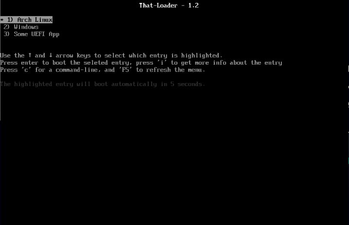
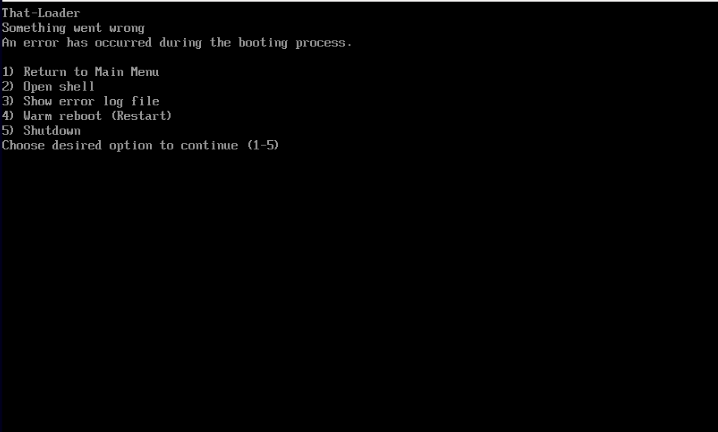
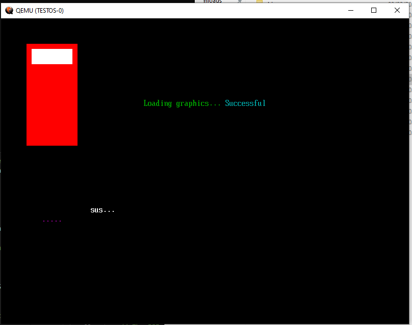

# That Loader
- That Loader is a weekend project developed by me, trying to learn OS internals more thoroughly, developed using [UEFI-POSIX](https://gitlab.com/bztsrc/posix-uefi) library, that will give me simpler, cleaner, easier code
# Project goals:
- Create a fully working UEFI bootloader
- Learn more about OS internals
- experiment with low level development
- experiment with linux environment development (which is the best)
# Building
### In a Linux environment
Run ``make`` in the projects root directory in order to create the boot manager's ``.efi`` file.
Default output is set to ``x86_64`` architecture, you can modify the architecture in the Makefile, yet other arcarchitectures are untested.
### In a Windows environment
Extract and run ``compileEFI.bat`` in order to build an ``.o``file.
if you want to create a ``.efi`` file, follow the emulation process

# Emulation
### In a Linux environment
Run ``make`` to create the boot managers's ``.efi`` file
Run ``./emulate-qemu.sh`` to open the qemu emulator with the boot manager
### In a Windows environment
Extract the ``build-for-emu.bat`` file from the ``batch scripts`` directory to the root directory
Run ``build-for-emu.bat`` - this will run the qemu emulator with the boot manager.

# Dependencies
### Building in a Linux enviorment
apt package manager - ``make`` ``gcc``/``clang`` ``efibootmgr`` ``lld ``
### Emulating in a Linux enviorment
``mtools`` ``qemu`` ``xorisso`` ``ovmf``
### Building / Emulating in a Windows enviorment
``gcc`` ``OSFMount`` [click here to install](https://www.osforensics.com/tools/mount-disk-images.html)

# Notes:
If You want to read my documentation I wrote throught the project, [you are more then welcome](https://docs.google.com/document/d/1qAuEJxM9V7jQSRxZ9wO2DUHWItQ9ld-mI5goBNlDA9s/edit?usp=sharing) (written in hebrew)

If you wish to test the program and do not have a config file, you can copy the content of [this file](https://pastebin.com/b4MfpZmr) and paste it in the ``add-to-image`` directory in a file named Config.cfg (this is important!)
# Screenshots

